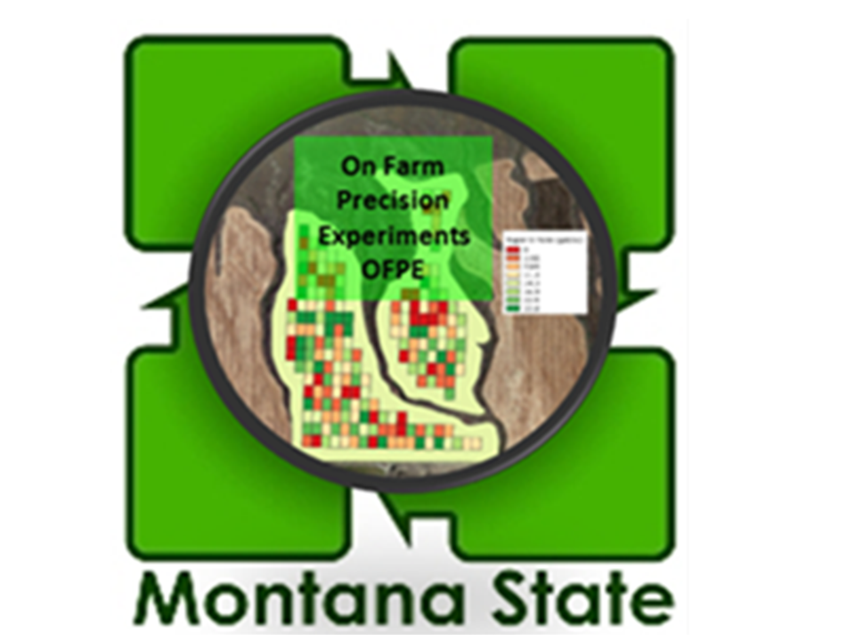

<right>    </right>

**Ecological Society of America**

This website documents the work presented at the annual ESA conference in August, 2020. 

* [ESA 2020](https://www.esa.org/saltlake/): 2020 ESA meeting and conference proceedings.

* [Data Informed Adaptive Management in Agriculture](): Link to this presentation.

```{r, echo=FALSE}
xfun::embed_file(path = "refs/hegedus_esa2020_08032020.pptx", 
                 name = "hegedus_esa2020_08032020.pptx", 
                 text = "Download: Hegedus-ESA2020")
```


This project uses data from the The [On-Field Precision Experiments project](https://sites.google.com/site/ofpeframework/), led by Dr. Bruce Maxwell at Montana State University. You can find more information about the OFPE project at the [OFPE Project Website](https://sites.google.com/site/ofpeframework/) where general information and associated publications are posted, the [OFPE Technical Website](https://paulhegedus.github.io/OFPE-Website/) which describes the OFPE data framework and cycle, and the [OFPE](https://github.com/paulhegedus/OFPE.git) and [OFPEDATA](https://github.com/paulhegedus/OFPEDATA.git) R package README files and the OFPE package vignettes. Finally, other data products associated with the OFPE project include the [OFPE Web Application](https://paulhegedus.shinyapps.io/OFPE_AnalysisAndSim_App_v1/?_ga=2.189182059.1336631904.1592115204-590292424.1592115204) and the [OFPE CropScan Application](https://paulhegedus.shinyapps.io/OFPE_Protein_Application/?_ga=2.69643152.1880072526.1592481594-590292424.1592115204).

Please reach out with comments, questions, or concerns about this project or the On-Farm Precision Experiments project. Better yet, feel free to reach out to collaborate, join, or learn more.

 * [Paul Hegedus](http://landresources.montana.edu/directory/researchassoc.html) <paulhegedus@montana.edu> - Github: <https://github.com/paulhegedus>
 * [Bruce Maxwell](http://landresources.montana.edu/directory/faculty/1524374/bruce-maxwell) <bmax@montana.edu>
 * [Stephanie Ewing](http://landresources.montana.edu/directory/faculty/1524074/stephanie-ewing) <stephanie.ewing@montana.edu>

### Abstract
**Background/Question/Methods**

Large amounts of on-farm and remotely sensed data can transform agriculture through implementation of adaptive management. The site, time, and history specificity of fields has complicated integration of ecological principles into an agriculture focused on regionwide prescriptions. Crop managers now have the ability to generate field-specific management plans using field-specific data to optimize inputs based on pollution minimization and profit maximization. For example, traditional nitrogen (N) fertilizer management consisted of applying a uniform rate, causing N inefficiencies and non-point nitrate pollution. Precision agriculture technologies provide an empirical approach to adaptive management. This research seeks to identify spatiotemporal drivers of variation in production (grain yield), quality (grain protein), and net-returns for Northern Great Plains small-grain agroecosystems and evaluates their relatedness and consistency between fields. Winter-wheat yield and protein, and as-applied N data have been collected from fields, along with remotely sensed topographic, weather, and historical vegetation index data, to evaluate the spatial variation in production, quality, and net-returns for wheat across  years. For four fields, generalized additive models were used to fit residuals of production, quality, and net-return as a function of as-applied N, topographic variables, weather, soil moisture, soil type, and prior productivity (NDVI up to two years prior).

**Results/Conclusions**

Regardless of management, every field experienced variation in production, quality, and net-returns across a field for a given year and across years for given points in fields. While in most fields, as-applied nitrogen was expected to be the major source of variation in crop responses when experimental rates were randomly applied, we have observed that in some cases, there was no crop response across varied nitrogen rates, indicating that the influence of prior management can negate the effects of current management. In years that uniform nitrogen rates were applied, the spatial variation in production and quality is driven by variables such as elevation, slope, aspect, or topographic position index, however across time, weather, such as precipitation and growing degree days, are the major temporal driver of variation in average production. Understanding the primary sources of field-specific variation in production and quality across the field and over time enables producers to identify if, when, and where nitrogen fertilizer should be applied. Equally important, the spatial and temporal resolution at which variability in agroecosystem performance can be detected creates a mechanism to monitor and ground-truth ecosystem response to global change.

### Funding

The OFPE project was initially funded by the Montana Research and Economic Development Initiative ([MREDI](https://mus.edu/research/research_initiative.html)) and is continued to be funded by the Montana Fertilizer Advisory Committee ([MFAC](https://agriculture.montana.edu/mfac/index.html)). Other funding sources include the Montana State University College of Agriculture ([MSU CoA](https://agriculture.montana.edu)), the MSU Department Land Resources and Environmental Sciences ([LRES](https://landresources.montana.edu)), and the Montana Institute on Ecosystems ([MT IoE](https://montanaioe.org)). Other support and funding has been provided by the Data Intensive Farm Management project at the University of Illinois ([DIFM](https://publish.illinois.edu/data-intensive-farm-managment/)). Funding for Paul Hegedus is provided by MSU and the Graduate Student Grants from the Western Sustainable Agriculture Research and Education (WSARE).

<center>         </center>

