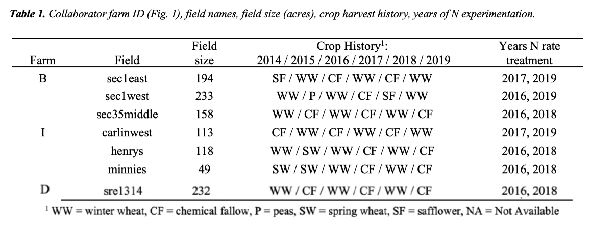
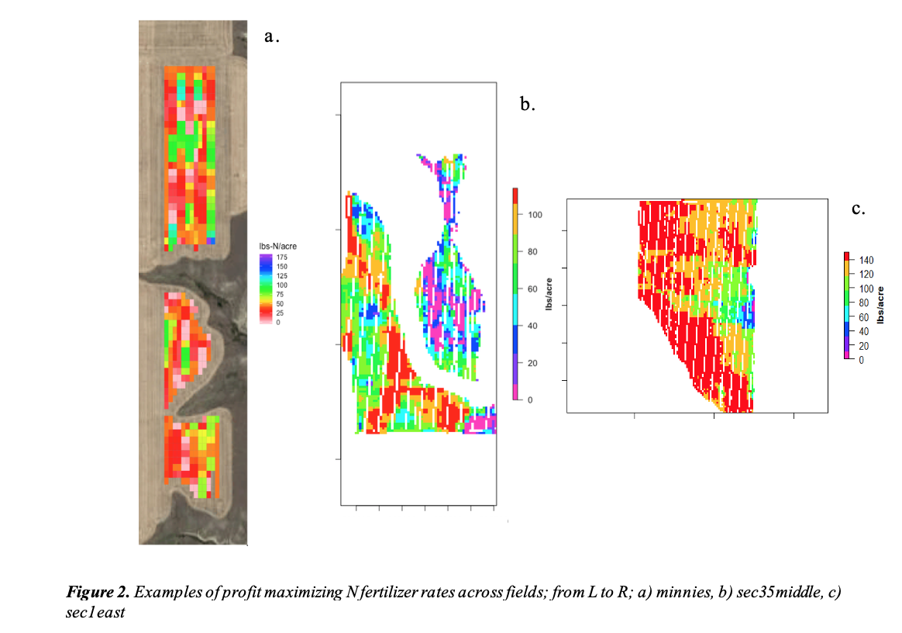
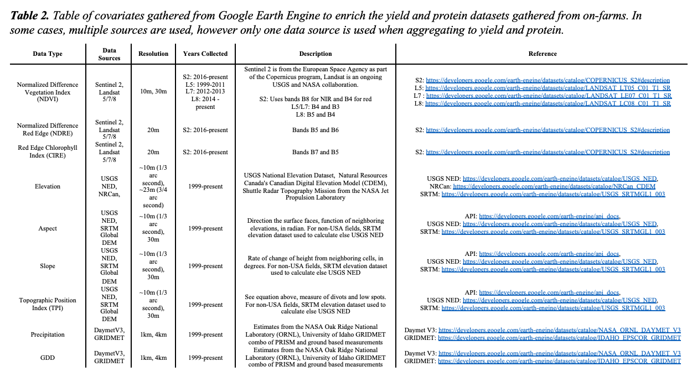

This research was conducted using farmers collaborating with the OFPE project at MSU. The OFPE framework for nitrogen fertilizer (N) management began on eight dryland fields at four conventionally  managed farms beginning in 2015 and has continued to do N-rate experiments on these fields in crop-fallow or crop-pulse crop rotations. The OFPE project has expanded to include five certified organic farms that are experimentally manipulating green manure crop seeding rates and following year wheat seeding rates to maximize profit and minimize weed populations. Potential farmer collaborators for the OFPE are evaluated based on their willingness to participate in the OFPE study for up to 10 years, their experience with PA technologies (yield monitor, and protein monitoring data), and variable fertilizer/seed rate application (VRA) in dryland winter wheat production. 

Three of the four conventional farms were selected for this study because of their data availability and quality and our focus on N fertilizer management. There were 3 fields on farm B, three fields on farm I, and one fields on farm D (Fig. 1, Table 1).  . These three producers were selected from the larger set of nine farmer collaborators, of which eight were selected from a survey sent to Montana small grain producers and one Canadian farmer were recruited. Fields selected were required to have experimental N data available from at least two years, as well as observed yield and protein measurements from across the entire the field. Nitrogen fertilizer rates were experientially applied across the field in blocks varying from 400 – 600 feet long and as wide as the farmer’s fertilize sprayer or spreader width, varying from 70 – 120 feet wide. Rates were randomly placed throughout the field, stratified on previous yield, protein, and N applied (Fig. 2).  

In conjunction with the Computer Science Department at MSU, a Python based computer application called Stratified Treatment Application Rates (STAR) was developed for the OFPE project for optimally applying experimental the N fertilizer trials within fields (Peerlinck, Sheppard, Pastorino, & Maxwell, 2019). The application (Fig. 3) receives several .csv files as input, which contain data regarding the field for which the experimental trial has to be created. The “field shape” .csv file is used to create a grid layout over the field, which adheres to the shape of the field. If the field already has a grid layout available, this can also be provided to the application, which means a new grid does not have to be created, saving time. Each grid cell is then assigned a nitrogen rate based on a previous year’s yield and, optionally, protein, which are provided by the user. The yield and protein values are used to determine which “bin” a specific grid cell belongs to. Bins can be delineated by the data values or number of observations, are then used to assign stratified experimental rates across the bins. The user can choose which experimental nitrogen rates to apply across the field. The application has the option to perform “rate change optimization” that uses a Genetic Algorithm to reduce large nitrogen rate jumps between consecutive cells, as this is hard on the application equipment. 

The response variables of interest are crop productivity (yield in bushels per acre) and quality (grain protein percent), both of which are gathered from monitors mounted in the cab of the farmer’s combine harvesters. Data from yield monitors are gathered an average of every three seconds and have become standard issue on most modern combines. Farm equipment used in this study varied between farmers and ranged from John Deere to Case. All yield monitors are calibrated every spring by the farmers, according to their respective manufacturing instructions. Grain protein content was measured with [Next Instrument’s CropScan 3300H](http://www.nextinstruments.net/index.php/products/cropscan/cropscan-3300h-on-header-analyser) near infrared monitor which was installed, maintained, and calibrated by [Triangle Ag Crop Consultants](https://www.triangleag.com). These data each are subjected to proprietary cleaning practices according to the software of the machine used to make the measurement and are subjected to further cleaning before analysis, including removal of observations where the yield/protein or distance from the next point in time was above or below 4SD from the mean, and removal of points within 30m of field boundary (Blackmore & Moore, 1999; Sudduth & Drummond, 2007; Sudduth, Drummond, & Myers, 2012). In addition to the yield, protein, and as-applied N data that are collected from the machines on the field, remotely sensed covariate data from open sources was gathered (Table 2). These data were gathered or derived from Google Earth Engine (Gorelick et al. 2017) and aggregated together at the locations of the observations in the yield and protein datasets. In some cases, the resolution of the data was greater than the size of the field, dictating that variation in this covariate is due to year to year differences.

Net-return was also a response variable of interest. Net-return is calculated as; 
$$PD = \beta_0 + \beta_1Protein + \beta_2Protein^2 $$
Where PD is the equation for protein premiums and dockages, and is fit using data from the Billings grain elevator in 2016 (most recent data available). 

$$Price Received = Bp + \beta_0PD + \beta_1PDProtein + \beta_2PDProtein^2$$
Where the price received is a function of Bp, the base-price received for wheat, and the coefficients of the PD equaiton and observed protein. 

$$NetReturn = Yield * PriceReceived - CN*N - FC$$
Where CN is the cost of nitrogen in dollars per pound, N is the pounds per acre of fertilizer applied, and FC are fixed costs associated per acre that are not related to fertilizer. The net-return in dollars per acre is equal to the yield multiplied by the price received with the cost of nitrogen and fixed costs subtracted.

A generalized additive model was fit with the OFPE parameters on training datasets and used for predicting both wheat yield, grain protein percent, and net-returns. Each model was fit for each field and year in the study and then subjected to a full sensitivity analysis where the value of all experimental variables and covariates were systematically increased and decreased by 10% individually. The change in estimated response for each point is recorded for the comparison of each change to the observed values to determine which variable contributed to the largest change in observed crop response. This was repeated for every field and year.

All data analysis was performed using R (R Core Team, 2020). The sensitivity of both yield and grain protein percent for each field was evaluated by calculating the elasticity compared to the default observed conditions. Elasticity was calculated as the absolute value of the difference between the average crop response in the default condition to the average crop response in the altered condition (with a covariate increased or decreased by 10%). The most elastic variables were grouped for each field across years and between fields by farms to assess trends in drivers of crop productivity and quality across space and time. 

